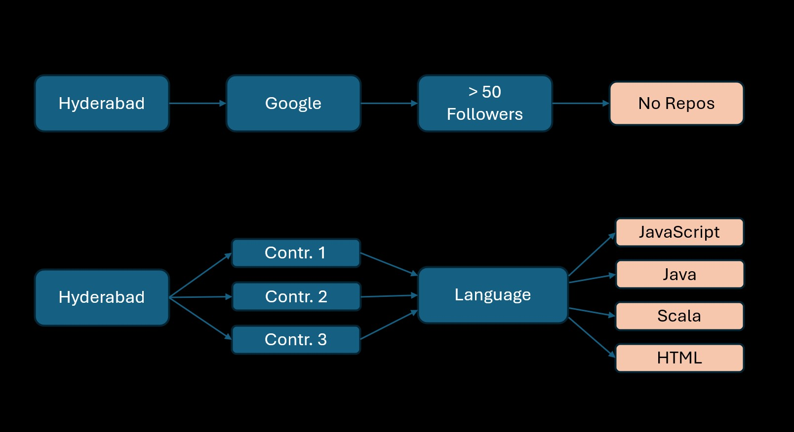

## IITM Tools in Data Science Project 1 - Hyderabad 50

### 1. Scraping mechanism <a href="https://github.com/Rajalakshmi12/IITM_Tds_Project1/blob/main/TDS-Project1.ipynb">(Colab)</a>

I scraped the data from the Github site using the github API with a personal access token  
             GITHUB_TOKEN =  'personal-token'  
             HEADERS = {'Authorization': f"token {GITHUB_TOKEN}",  
                        "Accept": "application/vnd.github.v3+json"  
             }  
      
USERS: https://api.github.com/search/users?q=location:Hyderabad+followers:>50&per_page=100&page={cur_page}

REPOSITORIES: https://api.github.com/users/{cur_user}/repos?per_page=100&page={current_page}

response = requests.get(<above-url>, headers=HEADERS)

   

<ul>

### 2. Some facts discovered from the analysis:

  <li>   Top 3 public repo contributors are working for <a href="https://github.com/Rajalakshmi12/IITM_Tds_Project1/blob/main/users.csv">
              Apple, MMTechSoft & Stealth Startup   </a>

</li>
          <li>    They had most of the contributions in Javascript, Java, Scala and HTML in this order
</li>
          <li>    Github Users from Hyderabad working in Google, did not have a single repository published
</li>
</ul>

      

### 3. An actionable recommendation for developers based on your analysis: ?

